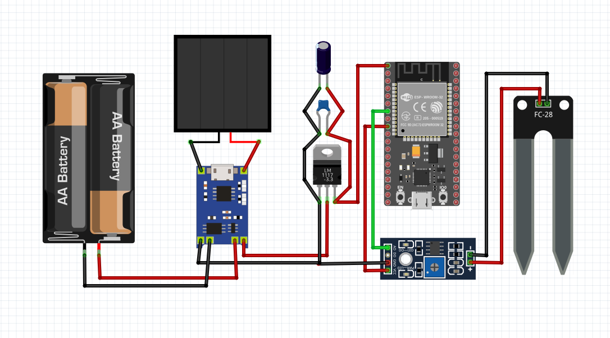
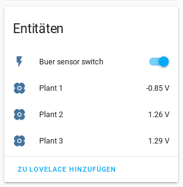

# Buer the flower deamon
This little project shows how to build a wireless soil moisture. To be flexible about the power for the device we use a solar panel for daztime and a battery for the night time. The lockstep would be to integrate the demon into the hassio environment.
## Items for the setup
* ESP32 NodeMCU
* FC-28 Soil moisture
* Samsung INR18650 25R 2500mAh 3,6V - 3,7V
* Solar panel output between 5V to 6V 
* TP4056 Micro USB 5V 1A Lithium charge module
* MCP1700-3302E 
* 100uF electrolytic capacitor
* 100nF ceramic capacitor

## How it should look like after


## ESPHOME hassio setup
FC-28 have analog and also a digital signal which could be adjusted over the blue wheel on the breakout board. In this example we choose the analog signal so we are able to set the boarder for when we have to water the plant in our Software.
``` 
sensor:
  - platform: adc
    pin: GPIO32
    filters:
      - calibrate_linear:
          - 0.36 -> 1.00
          - 0.76 -> 0.00
    name: "Plant 1"
    update_interval: 10s
```
It would be a nice thing to save power to shut down the FC-28. Also the FC-28 will go offline as soon the ESP go to deep sleep.
```
switch:
  - platform: gpio
    pin: GPIO25
    name: "Living Room Dehumidifier"
```
The soil of the plant will not change dry out so fast and to save power we send the ESP to deep sleep for a 1 hour and then we let him work for 10 min after he go back to sleep again.
```
deep_sleep:
  run_duration: 10min
  sleep_duration: 60min
```
## Integrate into hassio
After restart the ESP you should get a message that a new device was found, after adding the new device you should see something like that.


